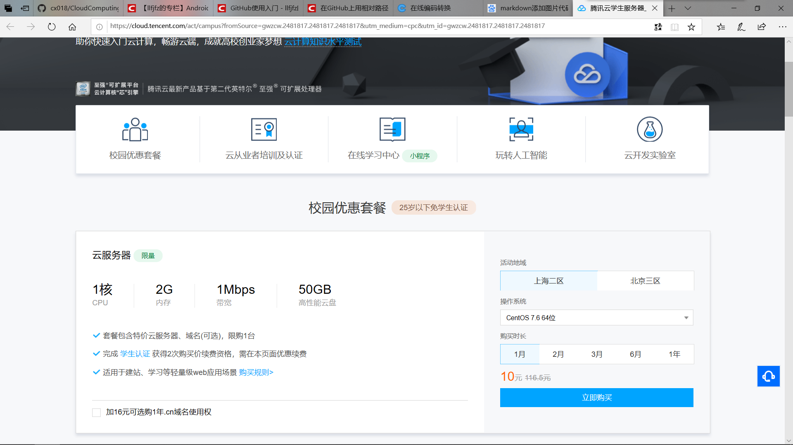
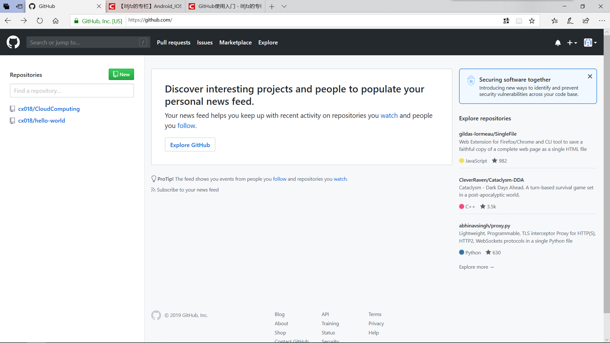
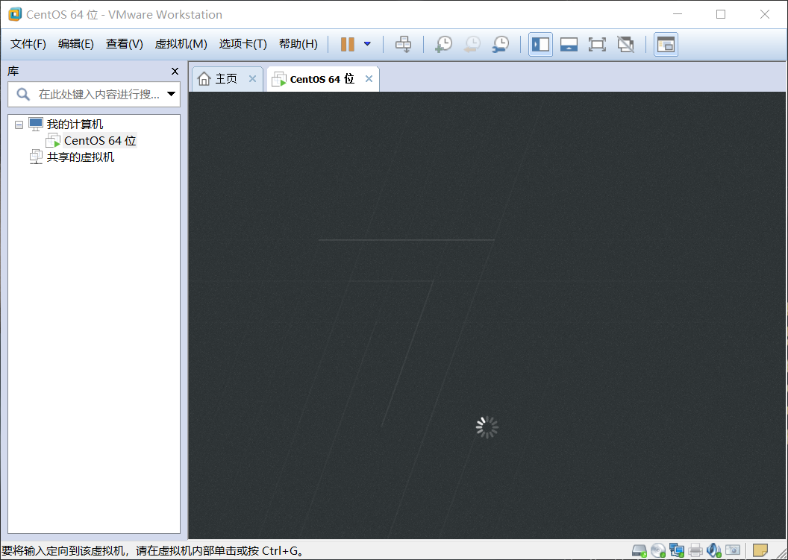
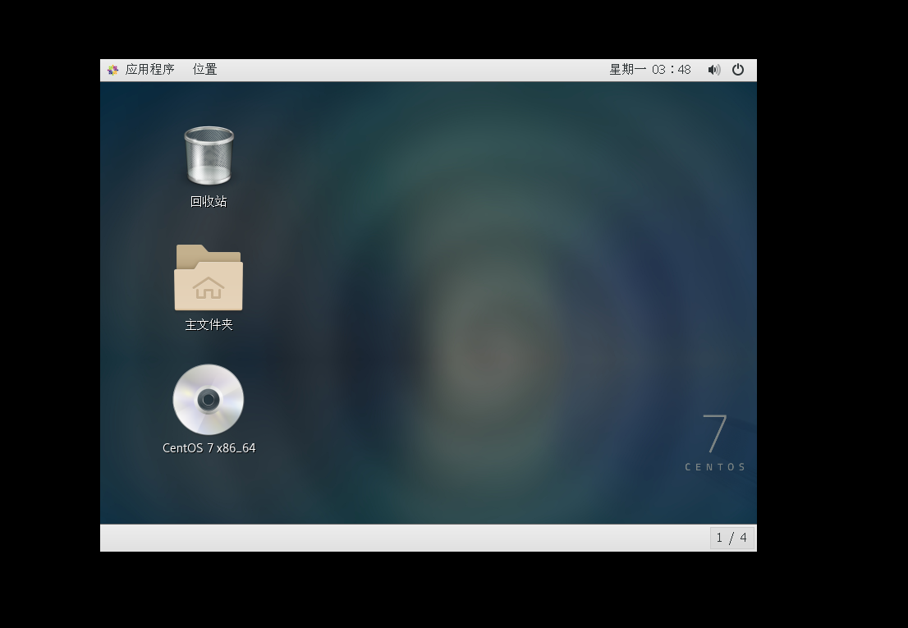

## 购买腾讯云服务器

## 使用Web Shell登录已购买的云服务器实例

## 下载安装Xshell（包含在Xmanager中），并使用 

## Xshell登录腾讯云实例

## 注册GitHub账号：https://github.com/

## 在GitHub上创建云计算项目（CloudComputing）并在本地同步

####  预备工作

### 创建SSH Key

1.

### 配置GitHub的用户名和邮箱

## 自行安装VMware WorkStation

## 在VMware WorkStation安装CentOS操作系统

