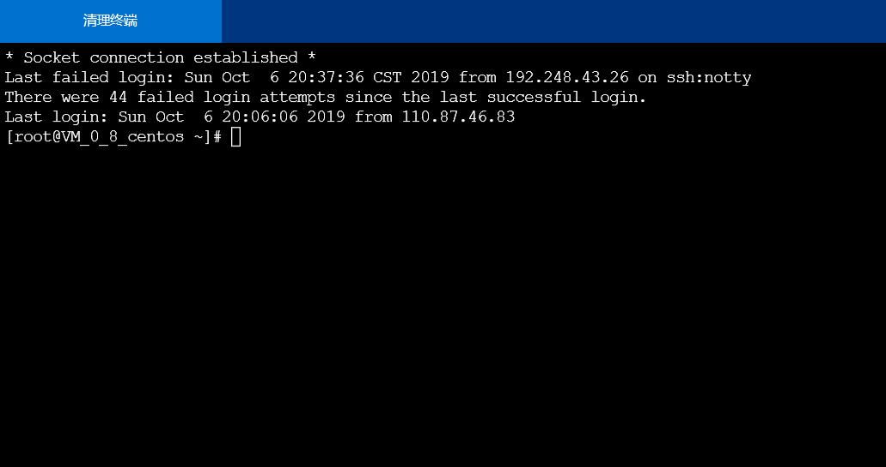
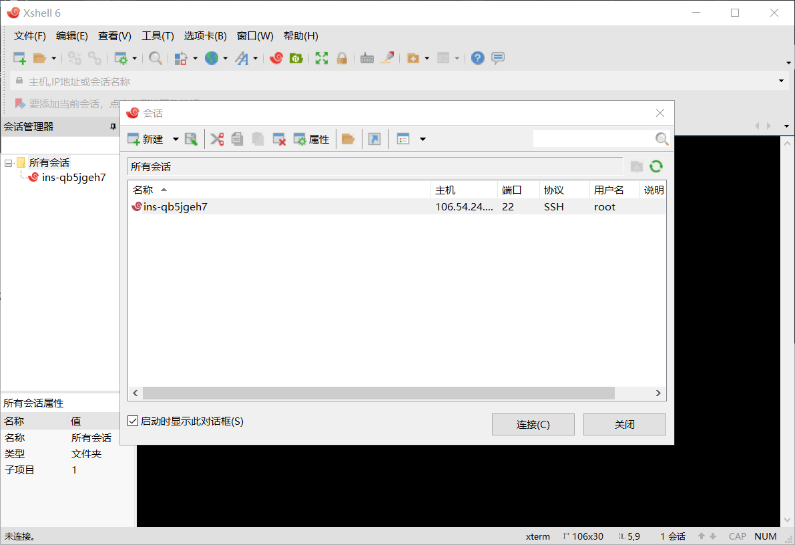
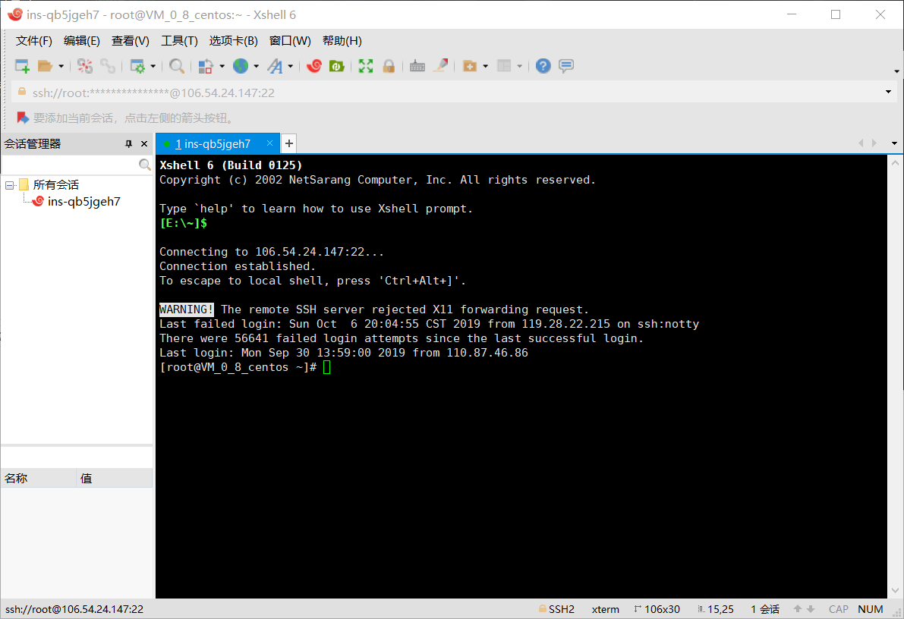
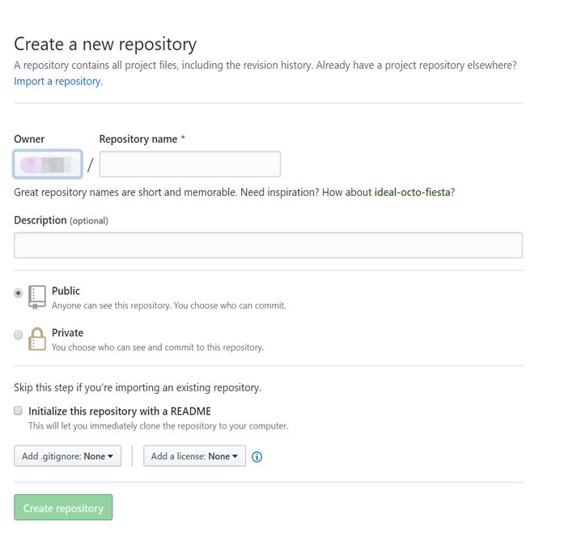
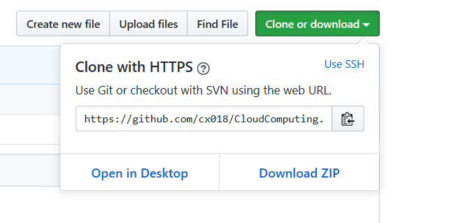

## 购买腾讯云服务器

## 使用Web Shell登录已购买的云服务器实例

## 下载安装Xshell（包含在Xmanager中），并使用 

## Xshell登录腾讯云实例

## 注册GitHub账号

## 在GitHub上创建云计算项目（CloudComputing）并在本地同步

####  

## **创建本地代码仓库**

首先在本地规划好一处文件夹用于同步GitHub的项目，然后打开Git Bash，定位到此次你想要同步的GitHub项目的文件夹，使用“cd”命令

1.初始化本地文件夹作为一个Git仓库

git init

2.拷贝GitHub网站中的项目网址

3.添加远程代码仓库的URL

git remote add origin  https://github.com/cx018/CloudComputing.git

git remote -v

4.首先从远程代码仓库拉取数据

git pull origin master

5.新建README文档，README文档是每个GitHub项目必备，说明项目内容。上文没有创建，在此处完成

touch README.md

6.添加文件夹中的所有文件

git add .

7.提交文件

git commit -m "First commit"

8.推送本地更新至远程服务器

git push -u origin master

## 自行安装VMware WorkStation

## 在VMware WorkStation安装CentOS操作系统

