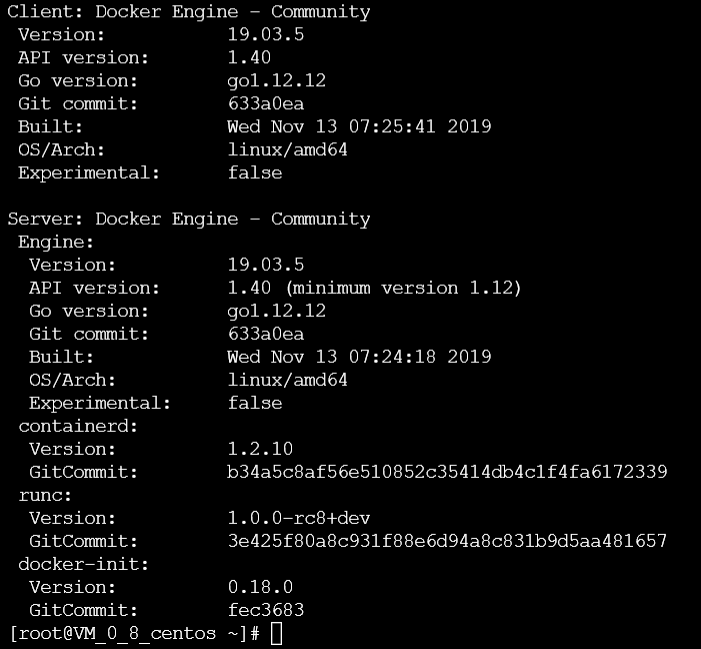
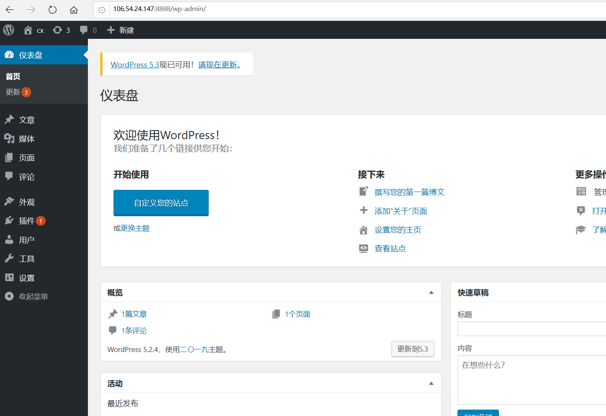
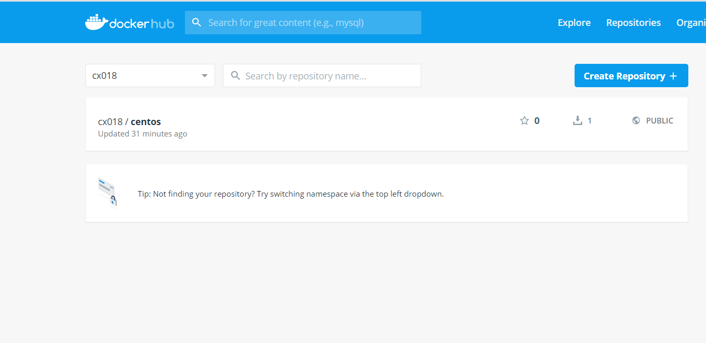

# Docker基础实验

## 1.CentsOs安装Docker

#### 更新应用程序数据库

sudo yum check-updata

#### 添加Docker官方仓库，安装最新Docker

curl -fsSL https://get.docker.com/ | sh

#### 启动Docker

sudo systemctl start docker

#### 设置Docker自启动

sudo systemctl enable docker

#### 查看Docker 版本信息

docker version

## 2.Docker加载CentOS镜像

#### 拉取 Centos  7

docker pull centos:7

#### 拉取完毕后查看镜像

docker images

#### 运行Docker容器

docker run -d -it --privileged --name wordpress -p 8888:80 -d centos:7 /usr/sbin/init

#### 查看已启动的容器

docker ps

#### 进入容器前台

##### docker exec -it 容器ID /bin/bash

例：

docker exec -it 2aeb8feb0e7e /bin/bash

## 3.容器中安装wordpress

#### 过程同实验2，但不需要sudo命令

## 4.推送带有wordpress的镜像

#### 注册docker hub账号

#### 创建私人仓库

#### 将容器生成镜像

##### docker commit -a “docker hub用户名” -m "提交描述" 容器id  镜像名:tag标签

##### 所生成的镜像名由   "Docker用户名/Docker仓库名组成"

docker commit -a "cx018" -m "wordpress on centos7" 2aeb8feb0e7e cx018/centos:v1

#### 登录Docker

docker login

#### 推送镜像

docker push cx018/centos

