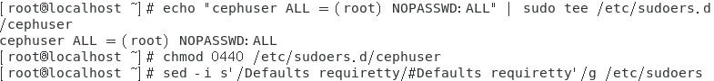
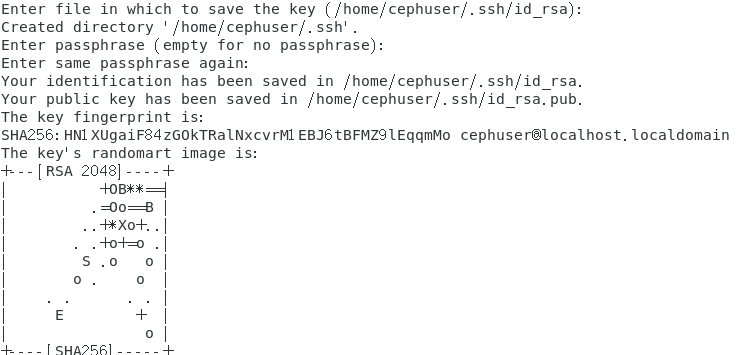
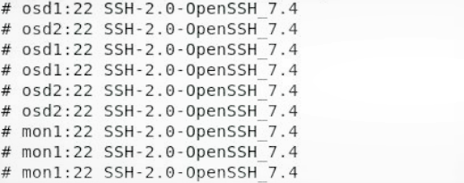

# Ceph的安装与实践 

#### 添加sudo权限

echo "cephuser ALL = (root) NOPASSWD:ALL" | sudo tee /etc/sudoers.d/cephuser

chmod 0440 /etc/sudoers.d/cephuser

sed -i s'/Defaults requiretty/#Defaults requiretty'/g /etc/sudoers

#### 安装配置ntp服务

yum install -y ntp ntpdate ntp-doc

ntpdate 0.us.pool.ntp.org

hwclock--systohc

systemctl enable ntpd.service

systemctl start ntpd.service

#### 安装Open-vm-tools

yum install -y open-vm-tools

#### 禁用SELINUX

sed -i 's/SELINUX=enforcing/SELINUX=disabled/g' /etc/selinux/config

##### 到目前为止，全部节点相同步骤都已配置完毕，复制虚拟机

#### 防火墙设置

systemctl start firewalld

systemctl enable firewalld

##### ceph -admin

sudo firewall-cmd --zone=public --add-port=80/tcp --permanent

sudo firewall-cmd --zone=public --add-port=2003/tcp --permanent

sudo firewall-cmd --zone=public --add-port=4505-4506/tcp --permanent

sudo firewall-cmd –reload

##### mon1节点防火墙

sudo firewall-cmd --zone=public --add-port=6789/tcp --permanent
sudo firewall-cmd --reload

##### osd1节点防火墙

sudo firewall-cmd --zone=public --add-port=6800-7300/tcp --permanent
sudo firewall-cmd --reload  

##### 为osd守护进程创建目录

osd1节点：

sudo mkdir /var/local/osd1

sudo chown ceph:ceph /var/local/osd1

osd2节点：

sudo mkdir /var/local/osd2

sudo chown ceph:ceph /var/local/osd2

#### 设置免密登录ssh

su - cephuser

#### 生成密钥

ssh-keygen

#### ssh配置文件

vi ~/.ssh/config

##### #内容

Host ceph-admin

Hostname ceph-admin

User cephuser

Host mon1

Hostname mon1

User cephuser

Host osd1

Hostname osd1

User cephuser

Host osd2

Hostname osd2

User cephuser

##### 更改配置文件的权限

chmod 644 ~/.ssh/config

ssh-keyscan osd1 osd2 mon1 >> ~/.ssh/known_hosts

##### 分发密钥

ssh-copy-id ceph-admin

ssh-copy-id mon1

ssh-copy-id osd1

ssh-copy-id osd2

##### 测试连接各节点ssh

ssh ceph-admin

ssh mon1

ssh osd1

ssh osd2

#### ceph-deploy安装

sudo yum update && sudo yum install ceph-deploy

##### 创建集群

mkdir my-cluster && cd my-cluster

ceph-deploy new mon1

vi ceph.conf

#####  #文件内容

osd pool default size = 2

public network = {ip-address}/{netmask}

 

#### 在其他节点安装ceph

ceph-deploy install ceph-admin mon1 osd1 osd2

##### 初始化mon1节点

ceph-deploy mon create-initial

ceph-deploy gatherkeys mon1

 

 

##### 将OSDS添加到集群

ceph-deploy osd prepare osd1:/var/local/osd1 osd2:/var/local/osd2

ceph-deploy osd activate osd1:/var/local/osd1 osd2:/var/local/osd2

##### 将管理密钥部署到所有关联的节点

ceph-deploy admin ceph-admin mon1 osd1 osd2

##### 通过在所有节点上运行以下命令来更改密钥文件的权限

sudo chmod 644 /etc/ceph/ceph.client.admin.keyring

 

##### 检查集群状态

sudo ceph -s

