#  腾讯云CentOS 7上搭建WordPress

## 前提

购买腾讯云服务器实例

## 部署环境：LAMP

- 云操作系统：CentOS 7.2 64位
- HTTP服务器：Apache Web 服务器
- 数据库：MySQL
- 建站工具：WordPress（基于PHP）

## 1.安装Apache Web服务器

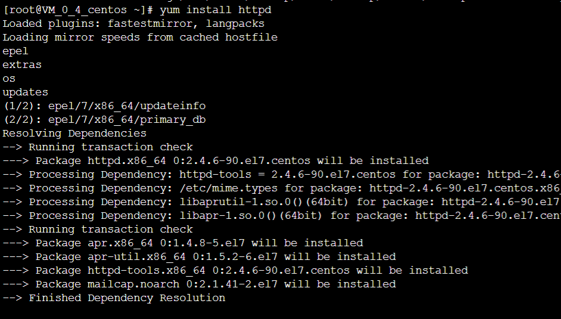

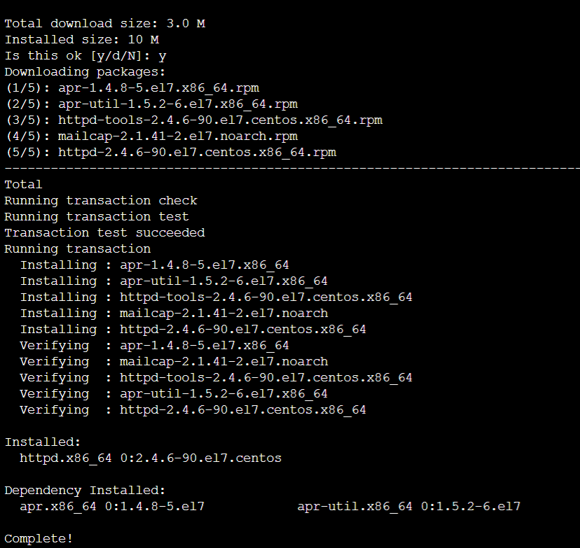

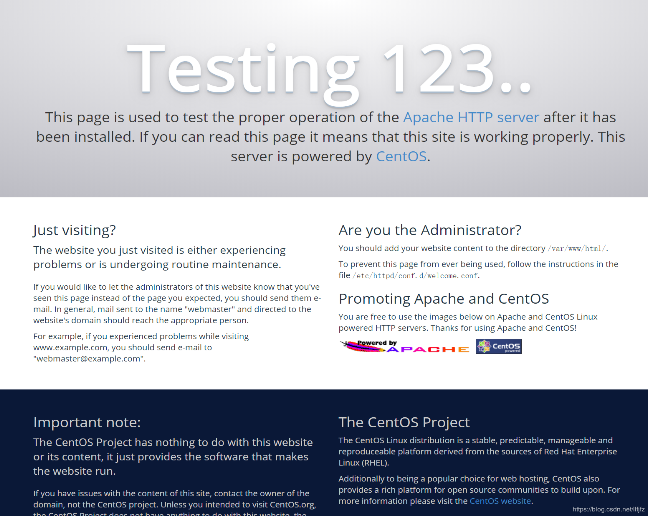

## 2.安装MySQL

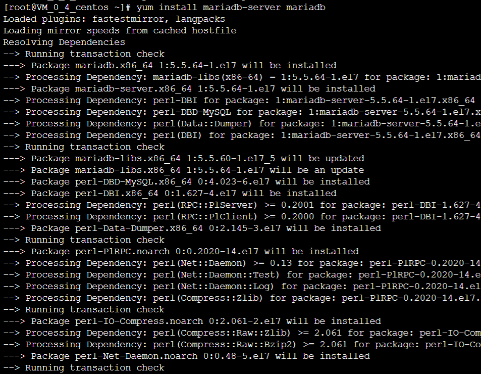

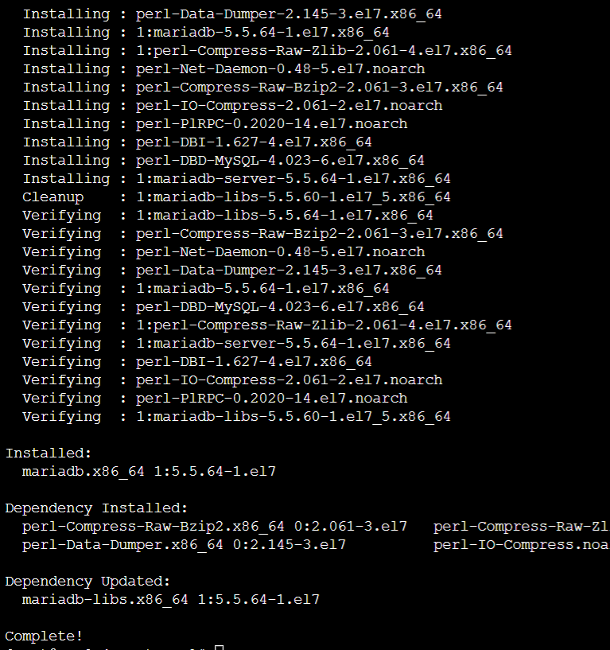

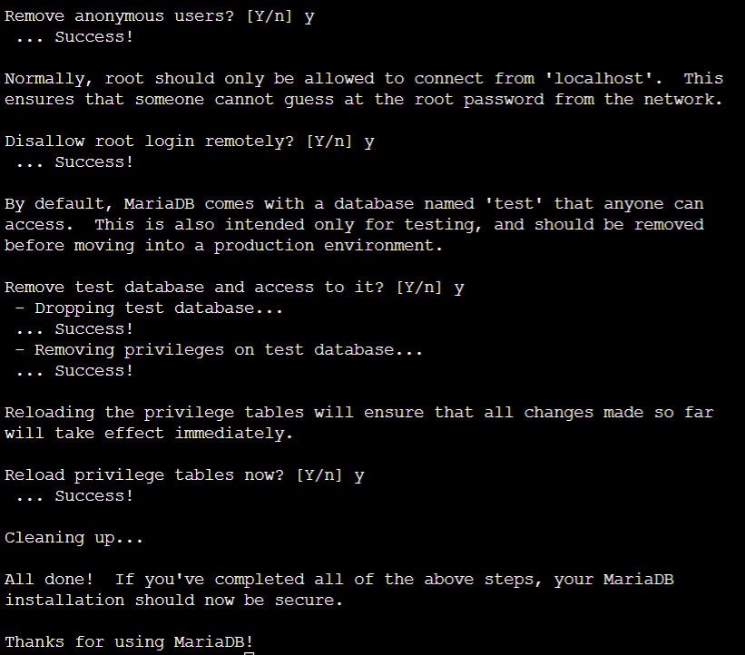

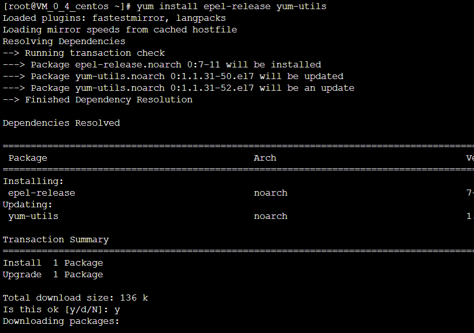

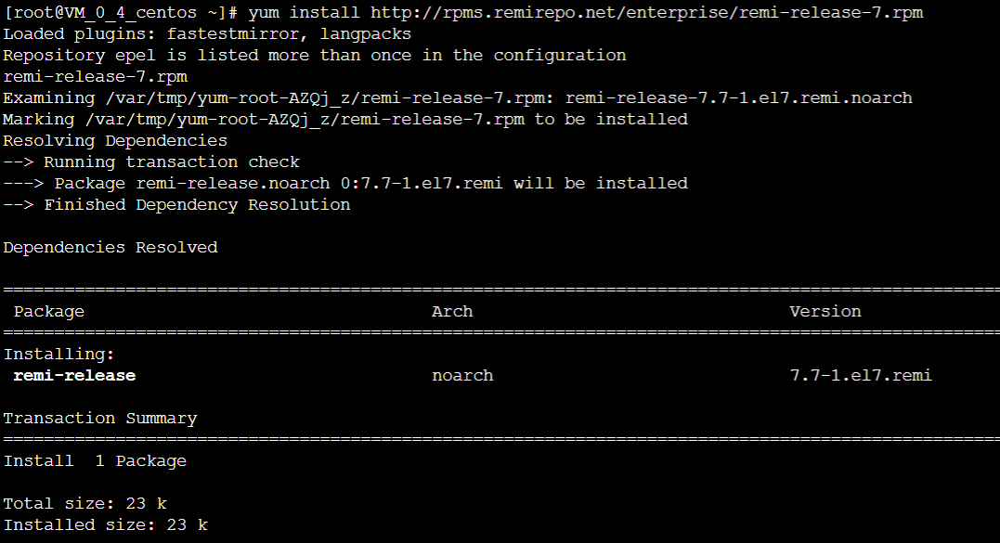

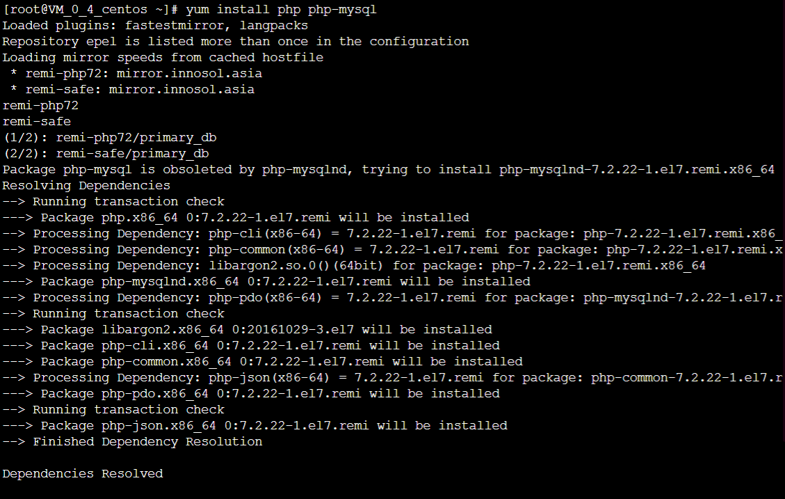

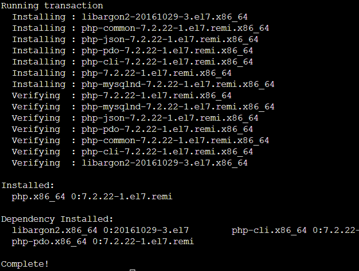

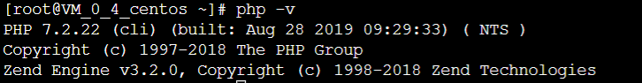

####  

## 3.安装PHP模块

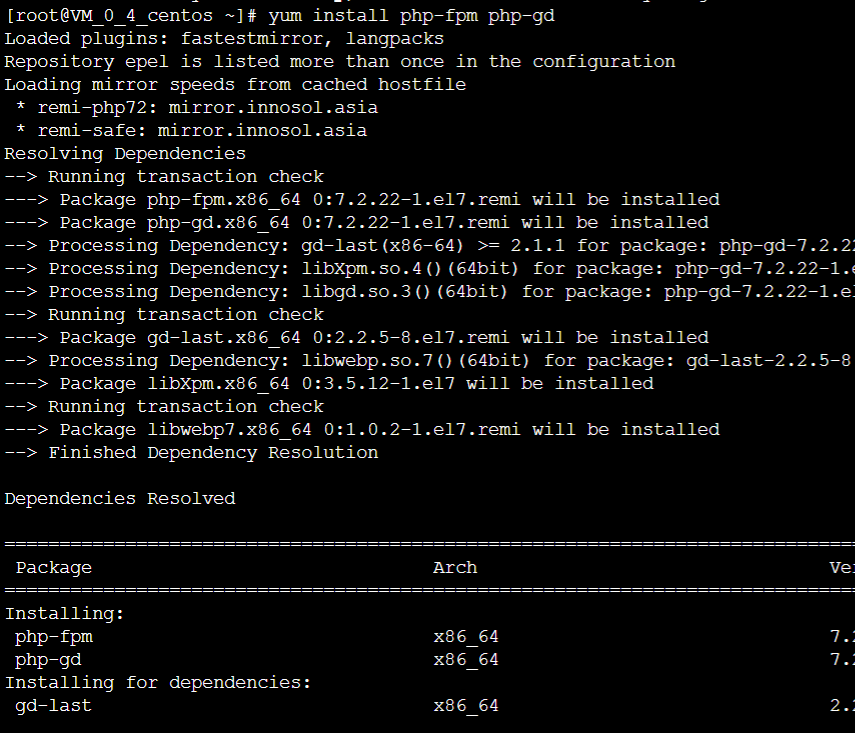

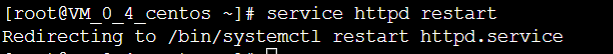

## 4.测试PHP

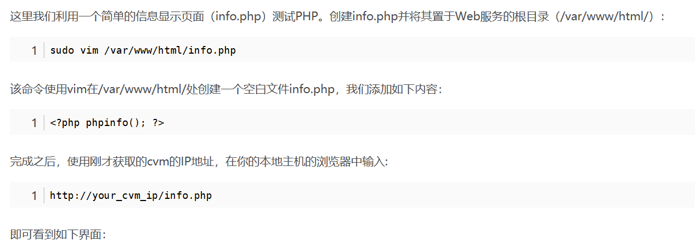

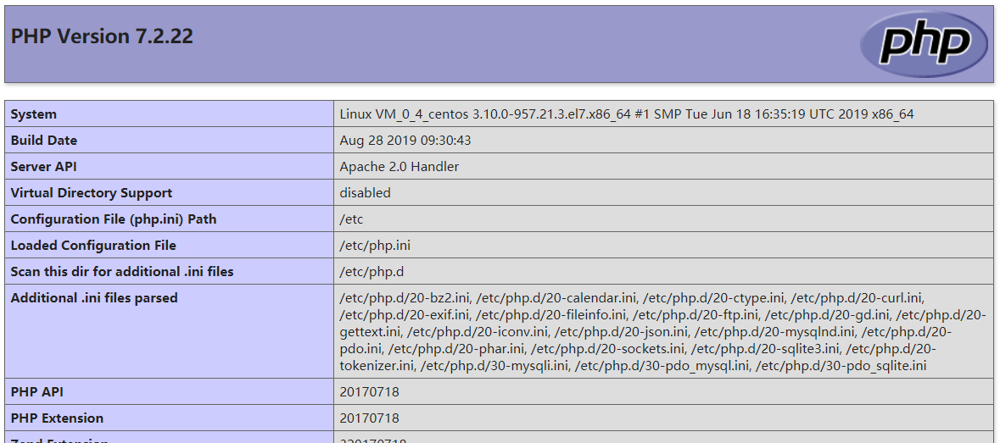

##  5.安装WordPress以及完成相关配置

###  (1)为WordPress创建一个MySQL数据库

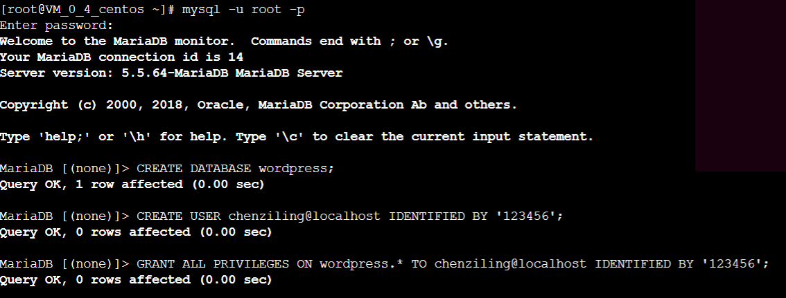

### (2)安装WordPress

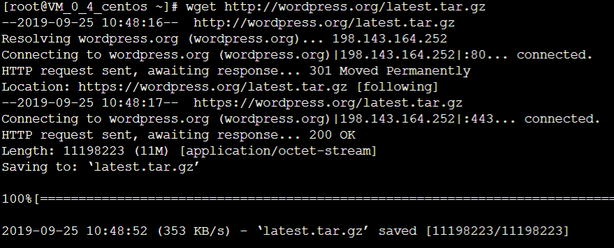

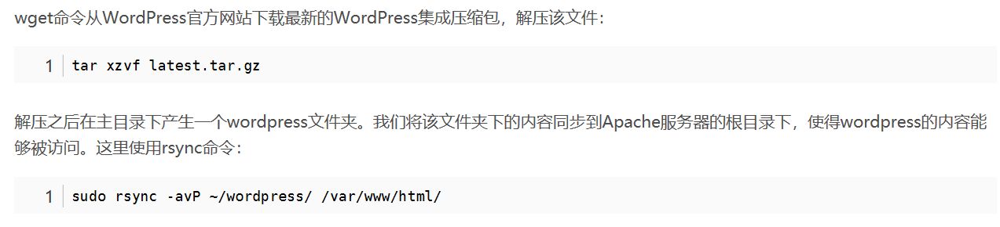

###  (3)配置WordPress

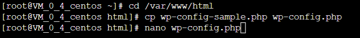

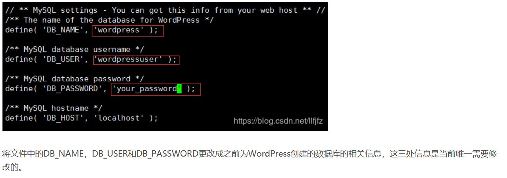

### (4)通过Web界面进一步配置WordPress

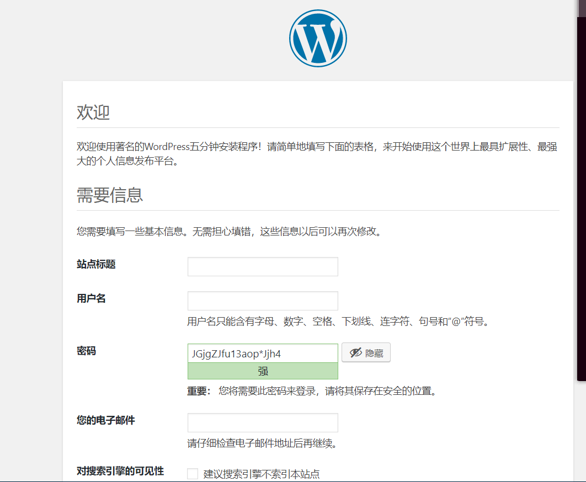

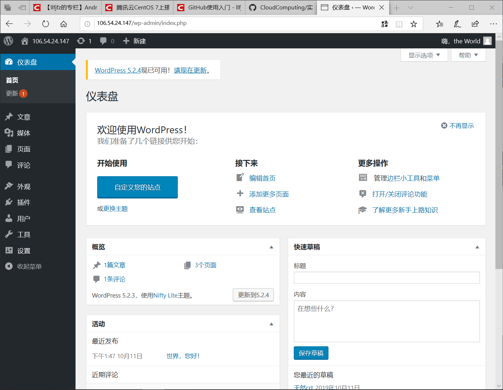